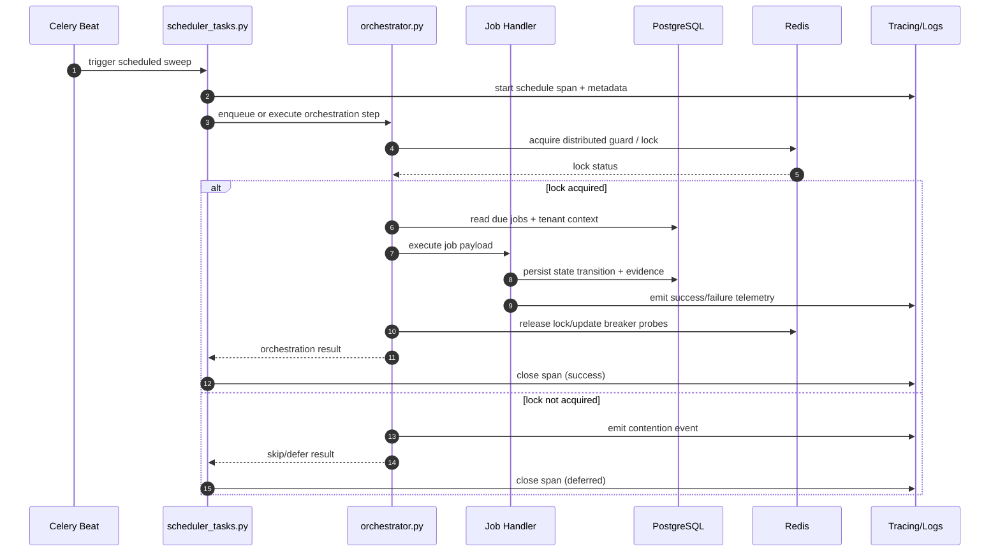

# Scheduler Orchestration Sequence (2026-03-06)

This document captures the runtime orchestration flow spanning:

- `app/tasks/scheduler_tasks.py`
- `app/modules/governance/domain/scheduler/orchestrator.py`
- scheduler/job handlers and persistence boundaries

## Core Sequence

## Concurrency and Deterministic Replay

- Lock/guard ownership is explicit at orchestration entry before mutable job
  transitions.
- Job handlers persist state transitions atomically to support deterministic replay.
- Deferred paths must log deterministic reason codes (`contention`, `guard`, or
  `dependency_unavailable`) to make reruns reproducible.

## Observability and Snapshot Stability

- Scheduler and handler spans capture:
  - job identity and tenant scope
  - timing and outcome status
  - retry/defer reason codes
- Evidence writes are versioned and persisted with stable schema fields to avoid
  export drift across retries.

## Failure Modes and Operational Misconfiguration Guards

- Redis unavailable:
  - protected distributed flows fail closed with explicit telemetry.
- Database transaction failure:
  - handler state changes roll back; orchestrator records failure reason and retry
    eligibility.
- Misconfigured queue/schedule:
  - startup/config validation blocks unsafe runtime where required env controls are
    missing.

